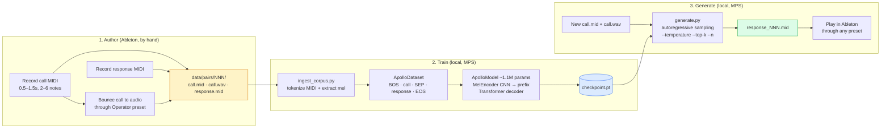

# Apollo

Generative call-and-response for Ableton Operator (FM synth). You play a short MIDI phrase routed through an Operator preset; Apollo emits a complementary MIDI response in your authored style.

The training corpus is hand-authored in Ableton: paired MIDI tracks (call + response), both running Operator. The model conditions on the rendered audio of the call so it has timbre context, then generates MIDI for the response side only.

This is v2.0. The prior piano/MAESTRO codebase lives on the `deprecated` branch as historical reference only — it is *not* a model lineage. Apollo v1 trains from scratch.

---

## How it works



**Three flows on one machine.** Everything runs on Apple Silicon (MPS) — no cloud, no GPU rental. The model is small (~1.1M params) by design.

**Why mel-condition on the call audio?** The Operator preset varies pair-to-pair. The model needs to "hear" the timbre of the prompt to know what a fitting response sounds like — a percussive bass call should not get the same response as a soft pad with the same notes.

**Why response-only loss?** Apollo is judged on what it generates, not on how well it reconstructs the prompt. Loss is masked to tokens after the `SEP` boundary.

---

## Quick start

```bash
python -m venv venv && source venv/bin/activate
pip install -e ".[dev]"

# Validate a corpus before training
python -m apollo.scripts.ingest_corpus data/pairs/

# Train on the real corpus (after ≥30 pairs are authored)
python -m apollo.scripts.train data/pairs/ \
  --epochs 300 --lr 1e-3 --batch-size 4 --iteration 1

# Generate a response
python -m apollo.scripts.generate \
  models/apollo_iter1_best.pt \
  data/pairs/001/call.mid data/pairs/001/call.wav \
  --n 4 --temperature 0.8 --top-k 10
```

`generate.py` writes `response_001.mid`, `response_002.mid`, … alongside the input call.

See [`data/pairs/CORPUS-CONVENTIONS.md`](data/pairs/CORPUS-CONVENTIONS.md) for authoring rules (120 BPM, preset variety, gesture length, file naming, ≥30 minimum).

---

## Project status

| Phase | Scope | Status |
|---|---|---|
| 1 | Tokenizer & ingest pipeline | ✓ Complete |
| 2 | MelEncoder + ApolloModel + training | ✓ Complete |
| 3 | Corpus conventions, `generate.py`, `train.py` | ✓ Code complete; ≥30 pairs pending |
| 4 | Evaluation loop & ship gate | Not started |

v1 ships only when two consecutive active-learning iterations both improve held-out rubric scores. The loop itself — author → train → listen → identify gaps → author more — is the product, not any single checkpoint.

Authoritative planning lives in [`.planning/`](.planning/) — see [PROJECT.md](.planning/PROJECT.md), [ROADMAP.md](.planning/ROADMAP.md), [REQUIREMENTS.md](.planning/REQUIREMENTS.md).

---

## Repo layout

```
apollo/
  ingest/          # MIDI tokenizer, mel extractor, pair discovery, hash split
  model/           # MelEncoder (CNN), ApolloModel (transformer + mel prefix), training loop
  scripts/         # ingest_corpus.py, train.py, train_smoke.py, generate.py
  tokenizer/       # vocab + token helpers
data/pairs/        # authored pairs live here (gitignored by default)
tests/             # pytest suite (run with `pytest`)
.planning/         # project context, phase plans, requirements, sketches
```

---

## Design constraints (locked for v1)

- **Train from scratch.** Piano priors actively conflict with FM material.
- **Monophonic, tiny gestures.** 0.5–1.5s, 2–6 notes per side, quantized to a 120 BPM grid.
- **Just-notes vocab.** Pitch / velocity / time-shift / duration only. The vocab reserves room for pitch bend / mod wheel / CC tokens so future extensions don't invalidate existing checkpoints.
- **Mel-condition the call.** `call.wav` is a manual Ableton bounce committed alongside the MIDI.
- **Local-only.** No Modal, no cloud, no GPU rental for v1.

A known v1 limitation: Operator patches can produce perceived rhythm via LFOs/envelopes that aren't in the MIDI. Apollo "hears" that texture via the mel encoder but can only respond with notes, not synthesis parameters. Calls leaning heavily on LFO rhythm will get rhythmically "straight" responses. Deferred to a later milestone.
